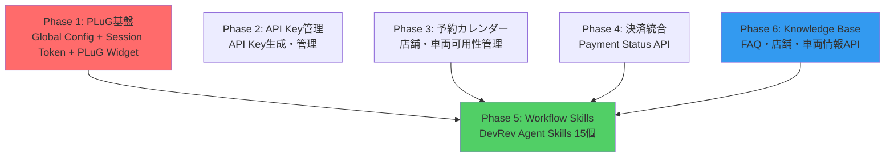

# 実装分析レポート - Cursor AI による詳細レビュー

> **生成日**: 2025 年 10 月 10 日  
> **最終更新**: 2025 年 10 月 11 日  
> **分析対象**: DriveRev セルフラーニングシステム実装計画ドキュメント  
> **分析者**: Cursor AI (Claude Sonnet 4.5)  
> **バージョン**: 2.0（決済・注文管理 GAP 追加、13 Issues に拡張）

---

## 📋 目次

1. [分析概要](#分析概要)
2. [Critical Issues（即座に解決が必要）](#critical-issues即座に解決が必要)
3. [高優先度の問題点](#高優先度の問題点)
4. [中優先度の改善点](#中優先度の改善点)
5. [ドキュメントの優れている点](#ドキュメントの優れている点)
6. [推奨される実装ロードマップ](#推奨される実装ロードマップ)

---

## 分析概要

本レポートは、DriveRev プロジェクトのハンズオンラボガイド（01-04）および関連ドキュメントをセルフラーニングシステムとして実装する観点から分析したものです。

### 分析対象ドキュメント

- `01_ARCHITECTURE.md`: アーキテクチャ設計と技術スタック比較
- `02_FEATURE_COMPARISON.md`: 機能比較と実装ギャップ分析
- `03_IMPLEMENTATION_PLAN.md`: 実装計画 - 段階的アプローチ
- `04_DEVREV_INTEGRATION.md`: DevRev 統合詳細設計
- ナレッジベース 3 ファイル（FAQ、店舗情報、車両タイプガイド）

### 分析の視点

1. ✅ **実装可能性**: 記載された内容が実装可能か
2. ✅ **完全性**: 必要な情報が揃っているか
3. ✅ **整合性**: ドキュメント間で矛盾がないか
4. ✅ **セキュリティ**: セキュリティ上の問題はないか
5. ✅ **実用性**: 実際のプロジェクトで使えるか

---

## Critical Issues（即座に解決が必要）

### 🔴 Issue #1: Veterinarian → Store 概念マッピングの矛盾

#### 問題の詳細

**ドキュメントの記述** (`01_ARCHITECTURE.md`, 行 299-306):

> 参照システム<!-- 旧称: PetStore --> の「Veterinarian（スタッフ）」は DriveRev では「Store（店舗）+ Vehicle 在庫」に置き換え
> スタッフの勤務スケジュール → 店舗の営業時間 + 車両のメンテナンス期間

#### なぜ問題か

1. **既存の Store モデルは完全に異なる概念**

   - DriveRev の `Store`: 物理的な店舗・営業所
   - 参照システム<!-- 旧称: PetStore --> の `Veterinarian`: 個人スタッフ（予約対象）

2. **予約ロジックの不整合**

   ```
   参照システム<!-- 旧称: PetStore -->:
   - ユーザーが「獣医を選択」→ その獣医の空き時間を検索

   DriveRev（現在の設計）:
   - ユーザーが「店舗を選択」→ ???
   - 店舗の営業時間は全車両共通
   - 車両ごとのメンテナンス期間も別管理
   ```

3. **実装計画との矛盾**
   - `Store` に `opening_hours` を追加（店舗全体）
   - `Vehicle` に `maintenance_periods` を追加（車両個別）
   - **どちらがメインの可用性管理なのか不明確**

#### 解決策の提案

**オプション A: 車両中心の可用性管理（推奨）**

```python
class Vehicle(Base):
    __tablename__ = "vehicles"

    # 既存フィールド
    id: UUID
    model: str
    type: str
    store_id: UUID

    # 新規追加: 車両固有の可用性管理
    maintenance_periods: list = Column(JSON, nullable=True)
    # 例: [
    #   {"start": "2024-02-01", "end": "2024-02-05", "reason": "定期点検"},
    #   {"start": "2024-03-15", "end": "2024-03-16", "reason": "タイヤ交換"}
    # ]

    availability_schedule: dict = Column(JSON, nullable=True)
    # 例: {
    #   "monday": {"available": true, "hours": "09:00-19:00"},
    #   "sunday": {"available": false, "reason": "休業日"}
    # }

    def is_available_on_period(
        self,
        start_date: datetime.date,
        end_date: datetime.date
    ) -> bool:
        """指定期間が利用可能かチェック"""
        # 1. メンテナンス期間との重複チェック
        # 2. 曜日別の利用可否チェック
        # 3. 店舗の営業時間チェック（Store.opening_hoursと併用）
        pass
```

**オプション B: Staff モデルの追加（参照システム<!-- 旧称: PetStore --> に忠実）**

```python
class Staff(Base):
    """店舗スタッフ（車両の管理担当者）"""
    __tablename__ = "staff"

    id: UUID = Column(UUID(as_uuid=True), primary_key=True, default=uuid.uuid4)
    name: str = Column(String(100))
    store_id: UUID = Column(UUID(as_uuid=True), ForeignKey('stores.id'))

    work_schedule: dict = Column(JSON)
    # 例: {
    #   "monday": {"work": true, "hours": "09:00-18:00"},
    #   "tuesday": {"work": true, "hours": "09:00-18:00"}
    # }

    # スタッフが管理する車両
    vehicles: list[Vehicle] = relationship("Vehicle", back_populates="staff")

class Vehicle(Base):
    staff_id: UUID = Column(UUID(as_uuid=True), ForeignKey('staff.id'))
    staff: Staff = relationship("Staff", back_populates="vehicles")
```

#### 推奨事項

✅ **オプション A（車両中心）を推奨**

**理由**:

1. レンタカー業界では「車両の可用性」が最優先
2. Staff モデルを追加すると複雑度が増す
3. 既存の DriveRev アーキテクチャに自然に適合

**実装手順**:

1. Vehicle モデルを拡張（`maintenance_periods`, `availability_schedule`）
2. Store モデルの `opening_hours` は店舗全体の営業時間として保持
3. 空き車両検索 API で両方を考慮したロジックを実装
4. Alembic マイグレーション計画に「既存データの初期値埋め込み」「サンプルデータ／テストデータの再生成」「整合性チェック」を明記し、移行時の不整合を防止

---

### 🔴 Issue #2: Session Token 永続化戦略が未定義

#### 問題の詳細

**ドキュメントの記述** (`04_DEVREV_INTEGRATION.md`, 行 134-166):

> **オプション 1**: 期限切れ時に再生成（推奨）
> **オプション 2**: サーバー側セッション管理

しかし、**どちらを採用するか決まっていない**。

#### なぜ問題か

1. **オプション 1（クライアント側管理）の問題**:

   - Token を DB に保存しない
   - 毎回新規生成 → DevRev API コール増加
   - ユーザーが複数タブを開いた場合の挙動が不明
   - ページリロードごとに再生成が必要

2. **オプション 2（サーバー側セッション）の問題**:

   - FastAPI でセッション管理をどう実装するか不明
   - JWT ベース認証と Session ベースの併用は複雑
   - Redis などのセッションストアが必要か？

3. **PLuG SDK 初期化のタイミング**:

   ```typescript
   // いつ Session Token を取得するのか？
   useEffect(() => {
     // オプション1: 毎回API呼び出し（重い）
     const token = await devrevApi.generateSessionToken();

     // オプション2: キャッシュされたTokenを使う（期限チェック必要）
     const cachedToken = await devrevApi.getSessionStatus();
   }, []);
   ```

#### 解決策の提案

**推奨: DB 保存方式（シンプルな折衷案）**

```python
# backend/app/models/user.py

class User(Base):
    # 既存フィールド
    devrev_app_id: str | None
    devrev_application_access_token: str | None
    devrev_revuser_id: str | None
    devrev_use_personal_config: bool = Column(Boolean, default=False)

    # 新規追加: Session Token管理
    devrev_session_token: str | None = Column(String(500), nullable=True)
    devrev_session_expires_at: datetime | None = Column(DateTime, nullable=True)

    def is_devrev_session_valid(self) -> bool:
        """Session Tokenが有効かチェック"""
        if not self.devrev_session_token:
            return False
        # 5分のバッファを持たせる
        return datetime.utcnow() < (self.devrev_session_expires_at - timedelta(minutes=5))

    async def get_or_create_session_token(self, db: Session) -> tuple[str, str]:
        """有効なSession Tokenと使用するApp IDを取得、なければ新規生成"""
        if self.devrev_use_personal_config and self.is_devrev_session_valid():
            return crypto_service.decrypt_aat(self.devrev_session_token), self.devrev_app_id  # type: ignore

        # 新規生成
        config_service = DevRevConfigService(db)
        if self.devrev_use_personal_config:
            if not self.devrev_app_id or not self.devrev_application_access_token:
                raise RuntimeError("Personal DevRev configuration is incomplete")
            aat = crypto_service.decrypt_aat(self.devrev_application_access_token)
            app_id = self.devrev_app_id
        else:
            config = config_service.get_global_config()
            if not config:
                raise RuntimeError("DevRev global configuration is not set")
            aat = config['aat']
            app_id = config['app_id']
            if self.devrev_session_token and self.is_devrev_session_valid():
                return crypto_service.decrypt_aat(self.devrev_session_token), app_id

        devrev_service = DevRevService(aat)
        session_token, revuser_id, expires_at = await devrev_service.create_session_token(
            email=self.email,
            full_name=self.full_name
        )

        # DB保存
        self.devrev_session_token = crypto_service.encrypt_aat(session_token)
        self.devrev_session_expires_at = expires_at
        self.devrev_revuser_id = revuser_id
        db.commit()

        return session_token, app_id
```

**セキュリティ / ライフサイクル補足**:

- Session Token も AAT と同様に暗号化保存するか、DB 側での暗号化を前提とするかを Phase 1 で確定する
- `devrev_session_expires_at` を利用した期限切れトークンの削除（バッチ／DB TTL どちらか）とローテーション手順を追加する
- 旧設計で使用していた `generate_session_token_from_devrev` ヘルパーの責務は `DevRevService.create_session_token` に集約し、DevRev API 呼び出しと例外処理を一元管理する
- ゲスト利用時は Global 設定を使って共有アカウントのセッションを発行する（個人設定は NULL）

**Frontend 実装**:

```typescript
// frontend/lib/api/devrev.ts

export const devrevApi = {
  // Session Token取得（ゲスト/個人どちらにも対応）
  async getSessionToken(): Promise<DevRevSessionToken | null> {
    const response = await apiClient.get<DevRevSessionToken>(
      "/devrev/session-token",
      {
        validateStatus: (status) => [200, 204].includes(status),
      }
    );
    if (response.status === 204) {
      return null; // DevRev未設定（ゲストでも利用不可）
    }
    return response.data;
  },
};

// frontend/app/layout.tsx
useEffect(() => {
  const initializePlug = async () => {
    try {
      const token = await devrevApi.getSessionToken();
      if (!token) {
        setPlugStatus("disabled");
        return;
      }
      window.plugSDK.init({
        app_id: token.app_id,
        session_token: token.session_token,
        on_ready: () => setPlugStatus("ready"),
        on_error: handlePlugError,
      });
    } catch (error) {
      console.error("Failed to initialize PLuG:", error);
      handlePlugError(error);
    }
  };

  initializePlug();
}, []);
```

#### 推奨事項

✅ **DB 保存方式を採用**

**メリット**:

- DevRev API コールを最小化（1 時間に 1 回のみ）
- 実装がシンプル
- 複数タブでも同じ Token を使用可能

**デメリット**:

- DB 容量が若干増える（許容範囲）

---

### 🔴 Issue #3: AAT 検証ロジックの脆弱性

#### 問題の詳細

**ドキュメントの記述** (`04_DEVREV_INTEGRATION.md`, 行 272-317):

```python
@router.post("/devrev/get-api-key")
async def get_api_key_with_aat(
    request: GetApiKeyRequest,
    devrev_aat: str = Header(..., alias="Authorization"),
    db: Session = Depends(get_db)
):
    user = db.query(User).filter(User.devrev_revuser_id == revuser_id).first()

    # AATの検証
    if devrev_aat != config['aat']:
        raise HTTPException(...)
```

#### なぜ問題か

1. **単純な文字列比較は危険**:

   - AAT が盗まれた場合、誰でも API Key を取得できる
   - RevUser ID の改ざんが可能

2. **DevRev API での検証が必要**:

   - AAT が本当に有効か確認されていない
   - AAT の権限スコープが検証されていない

3. **セキュリティホール**:
   ```
   攻撃者が盗んだAATを使って:
   1. 任意のRevUser IDを指定
   2. get-api-keyエンドポイントを呼び出し
   3. 他人のAPI Keyを取得可能
   ```

#### 解決策の提案

```python
# backend/app/services/devrev_service.py（サービス層の既存モジュールを拡張）

import requests
from typing import Optional

class DevRevService:
    def __init__(self, aat: str):
        self.aat = aat
        self.base_url = "https://api.devrev.ai"

    async def verify_aat_and_get_revuser(self) -> Optional[dict]:
        """
        AATを検証し、RevUser情報を取得

        Returns:
            {
                "revuser_id": "don:identity:xxx",
                "email": "user@example.com",
                "display_name": "John Doe"
            }
        """
        try:
            # DevRev APIでAAT検証
            response = requests.get(
                f"{self.base_url}/dev-users.self",
                headers={
                    "Authorization": self.aat,
                    "Content-Type": "application/json"
                },
                timeout=10
            )
            response.raise_for_status()

            data = response.json()
            return {
                "revuser_id": data.get("id"),
                "email": data.get("email"),
                "display_name": data.get("display_name")
            }
        except requests.RequestException as e:
            # AAT無効
            return None

# backend/app/api/v1/devrev.py

@router.post("/devrev/get-api-key", response_model=ApiKeyResponse)
async def get_api_key_with_aat(
    request: GetApiKeyRequest,
    devrev_aat: str = Header(..., alias="Authorization"),
    db: Session = Depends(get_db)
):
    """
    Get user's API key using DevRev AAT and RevUser ID.

    セキュリティ強化版:
    1. DevRev APIでAATを検証
    2. AATから取得したRevUser IDと一致確認
    3. API Key返却
    """
    # 1. DevRev APIでAAT検証
    devrev_service = DevRevService(devrev_aat)
    revuser_info = await devrev_service.verify_aat_and_get_revuser()

    if not revuser_info:
        raise HTTPException(
            status_code=status.HTTP_401_UNAUTHORIZED,
            detail="Invalid Application Access Token"
        )

    # 2. RevUser IDの一致確認
    if revuser_info["revuser_id"] != request.revuser_id:
        raise HTTPException(
            status_code=status.HTTP_403_FORBIDDEN,
            detail="RevUser ID mismatch. AAT does not match the requested user."
        )

    # 3. ユーザー検索
    user = db.query(User).filter(
        User.devrev_revuser_id == revuser_info["revuser_id"]
    ).first()

    if not user:
        raise HTTPException(
            status_code=status.HTTP_404_NOT_FOUND,
            detail="User not found in DriveRev system"
        )

    # 4. API Key確認
    if not user.api_key:
        raise HTTPException(
            status_code=status.HTTP_404_NOT_FOUND,
            detail="User has no active API key. Please generate one first."
        )

    return ApiKeyResponse(
        api_key=user.api_key,
        user_info={
            'email': user.email,
            'full_name': user.full_name,
            'revuser_id': user.devrev_revuser_id
        }
    )
```

**非同期処理の留意点**:

- `requests` は同期 I/O のため FastAPI のイベントループをブロックする
- `httpx.AsyncClient` 等の非同期クライアントを利用するか、`asyncio.to_thread` で同期処理をオフロードする設計方針を明記する
- API 呼び出しのタイムアウト／リトライ戦略をサービス層で統一し、待機時間が長引いた場合でもスループットを維持できるようにする

#### 推奨事項

✅ **必ず DevRev API で AAT を検証する**

**理由**:

- セキュリティの基本原則（信頼できない入力は検証する）
- AAT の有効性を確認
- RevUser ID の改ざんを防止

---

### 🔴 Issue #4: 決済・注文管理の GAP が完全に欠落

#### 問題の詳細

**参照システム<!-- 旧称: PetStore --> と DriveRev の実装状況**:

DriveRev には**完全な決済機能**が実装されているにもかかわらず、分析ドキュメントではこれが完全に見落とされています:

**DriveRev の既存実装**:

- `app/services/payment.py` - 決済処理サービス
- `app/api/v1/payments.py` - 決済 API エンドポイント
- `app/services/webhook_receipt.py` - Webhook・領収書サービス
- Reservation モデルに決済関連フィールド（`payment_method`, `payment_status`, `payment_reference`）
- 冪等性キーによる重複決済防止機能

**参照システム<!-- 旧称: PetStore --> の Workflows（15 個確認済み）**:

```
1. Get Appointments - 予約一覧取得
2. Get User Info - ユーザー情報取得
3. Get API Key - APIキー取得
4. Assign Conversation - 会話のアサイン
5. Resolve Conversation - 会話のクローズ
6. Get Tracking Info - 配送追跡情報
7. Create Ticket - サポートチケット作成
8. Register Account - アカウント登録
9. Get All Pets - ペット一覧
10. Get Order Status - 注文ステータス確認
11. Get All Services - サービス一覧
12. Get All Staff - スタッフ一覧
13. Get Available Slots - 空き時間検索
14. Get Available Staff - 対応可能スタッフ
15. Book Appointment - 予約作成
```

#### なぜ問題か

1. **欠落している Workflow Skills**

   Phase 5 で提案されている 7 つの Skills には、以下が**未考慮**:

   | 参照システム<!-- 旧称: PetStore --> Workflow | DriveRev 対応（必要）                     | 現在の分析 |
   | -------------------------------------------- | ----------------------------------------- | ---------- |
   | Get Appointments                             | Get Reservations（予約一覧）              | ❌ なし    |
   | Get Order Status                             | Get Payment Status（決済状況）            | ❌ なし    |
   | Get Tracking Info                            | Get Reservation Status（予約状況詳細）    | ❌ なし    |
   | Register Account                             | Register User（ユーザー登録）             | ❌ なし    |
   | Create Ticket                                | Create Support Ticket（サポートチケット） | ❌ なし    |
   | Assign Conversation                          | Assign Conversation（会話管理）           | ❌ なし    |
   | Resolve Conversation                         | Resolve Conversation（会話管理）          | ❌ なし    |

2. **Phase 5 の工数見積もりが不正確**

   - 現在の見積: 7 つの Workflow Skills = 2 週間
   - 実際に必要: **最低 13-15 の Workflow Skills = 3-4 週間**

3. **ビジネスロジックの複雑性が未考慮**

   ```python
   # DriveRevには以下の複雑な決済ロジックが存在

   # 1. 冪等性キーによる重複決済防止
   if idempotency_key and existing_payment:
       return existing_payment

   # 2. 複数の決済ステータス管理
   # pending, processing, completed, failed, refunded

   # 3. Webhook処理
   # 決済ゲートウェイからの非同期通知

   # 4. 領収書生成
   # PDF生成、メール送信
   ```

#### 解決策の提案

**完全版 Workflow Skills リスト（15 個）**

```json
{
  "phase_5_workflow_skills": [
    {
      "skill_name": "Get API Key",
      "description": "AATとRevUser IDを使ってAPIキー取得",
      "priority": "Critical",
      "estimated_hours": 4
    },
    {
      "skill_name": "Get User Info",
      "description": "ユーザー情報取得（プロフィール、予約履歴）",
      "priority": "High",
      "estimated_hours": 3
    },
    {
      "skill_name": "Search Available Vehicles",
      "description": "日付・店舗・車種で空き車両検索",
      "priority": "Critical",
      "estimated_hours": 6
    },
    {
      "skill_name": "Create Reservation",
      "description": "新規予約作成",
      "priority": "Critical",
      "estimated_hours": 6
    },
    {
      "skill_name": "Get Reservations",
      "description": "予約一覧取得（フィルタリング対応）",
      "priority": "High",
      "estimated_hours": 4
    },
    {
      "skill_name": "Cancel Reservation",
      "description": "予約キャンセル（キャンセルポリシー適用）",
      "priority": "High",
      "estimated_hours": 5
    },
    {
      "skill_name": "Get Payment Status",
      "description": "決済ステータス確認",
      "priority": "High",
      "estimated_hours": 3
    },
    {
      "skill_name": "Search FAQ",
      "description": "FAQ検索（Knowledge Base API）",
      "priority": "Medium",
      "estimated_hours": 3
    },
    {
      "skill_name": "Get Store Info",
      "description": "店舗情報取得（営業時間、アクセス）",
      "priority": "Medium",
      "estimated_hours": 2
    },
    {
      "skill_name": "Get Vehicle Types",
      "description": "車両タイプ一覧・詳細情報",
      "priority": "Medium",
      "estimated_hours": 2
    },
    {
      "skill_name": "Register User",
      "description": "新規ユーザー登録",
      "priority": "Medium",
      "estimated_hours": 4
    },
    {
      "skill_name": "Create Support Ticket",
      "description": "サポートチケット作成",
      "priority": "Low",
      "estimated_hours": 3
    },
    {
      "skill_name": "Assign Conversation",
      "description": "会話を担当者にアサイン",
      "priority": "Low",
      "estimated_hours": 2
    },
    {
      "skill_name": "Resolve Conversation",
      "description": "会話をクローズ",
      "priority": "Low",
      "estimated_hours": 2
    },
    {
      "skill_name": "Get Reservation Status",
      "description": "予約状況の詳細追跡",
      "priority": "Medium",
      "estimated_hours": 3
    }
  ],
  "total_estimated_hours": 52,
  "total_estimated_weeks": 3.5
}
```

#### 実装例: Get Payment Status Workflow

```python
# backend/app/api/v1/devrev.py

@router.post("/devrev/skills/get-payment-status", response_model=PaymentStatusResponse)
async def get_payment_status_skill(
    request: PaymentStatusRequest,
    devrev_aat: str = Header(..., alias="Authorization"),
    db: Session = Depends(get_db)
):
    """
    DevRev Workflow Skill: Get Payment Status

    予約の決済状況を取得
    """
    # 1. AAT検証
    devrev_service = DevRevService(devrev_aat)
    revuser_info = await devrev_service.verify_aat_and_get_revuser()

    if not revuser_info:
        raise HTTPException(status_code=401, detail="Invalid AAT")

    # 2. ユーザー確認
    user = db.query(User).filter(
        User.devrev_revuser_id == revuser_info["revuser_id"]
    ).first()

    if not user:
        raise HTTPException(status_code=404, detail="User not found")

    # 3. 予約・決済情報取得
    reservation = db.query(Reservation).filter(
        Reservation.id == request.reservation_id,
        Reservation.customer_id == user.id
    ).first()

    if not reservation:
        raise HTTPException(status_code=404, detail="Reservation not found")

    # 4. 決済ステータス返却
    return PaymentStatusResponse(
        reservation_id=str(reservation.id),
        confirmation_number=reservation.confirmation_number,
        payment_status=reservation.payment_status,
        payment_method=reservation.payment_method,
        total_amount=float(reservation.total_amount),
        paid_amount=float(reservation.total_amount) if reservation.payment_status == "completed" else 0,
        payment_date=reservation.updated_at if reservation.payment_status == "completed" else None,
        refund_amount=0,  # TODO: 返金テーブルから取得
        receipt_url=f"/api/v1/payments/receipt/{reservation.payment_reference}" if reservation.payment_reference else None
    )
```

#### 推奨事項

✅ **Phase 5 を 3.5-4 週間に修正**

✅ **15 個の Workflow Skills を実装**

✅ **決済関連エンドポイントの認証強化**

**理由**:

- 参照システム<!-- 旧称: PetStore --> との完全な機能パリティを実現
- DriveRev の既存決済機能を最大限活用
- セルフラーニングとして実用的なシステム

---

### 🔴 Issue #5: ビジネスモデルの根本的な違いが未分析

#### 問題の詳細

**参照システム<!-- 旧称: PetStore --> と DriveRev は表面的に「予約システム」という類似性があるが、ビジネスの性質が全く異なる**

| 観点                   | 参照システム<!-- 旧称: PetStore --> | DriveRev                      | セルフラーニングへの影響     |
| ---------------------- | ----------------------------------- | ----------------------------- | ---------------------------- |
| **予約対象**           | サービス（獣医の診察）              | 製品（車両レンタル）          | 在庫管理ロジックが必要       |
| **時間単位**           | 30 分〜1 時間のスロット             | 日単位（1 日〜数週間）        | 時間計算アルゴリズムが異なる |
| **リソース制約**       | 獣医の勤務時間                      | 車両の物理的可用性            | 同時予約の競合解決が必要     |
| **キャンセルポリシー** | 柔軟（前日まで無料）                | 厳格（数日前、違約金）        | キャンセル料金計算ロジック   |
| **料金計算**           | 固定料金                            | 日数 × 車種 × 保険 × 乗り捨て | 複雑な料金計算エンジン       |
| **返却の概念**         | なし                                | あり（別店舗返却可能）        | 返却処理、乗り捨て料金       |
| **在庫管理**           | なし（スタッフは常駐）              | あり（車両は有限リソース）    | 排他制御、在庫引当           |
| **運転資格**           | なし                                | 免許証・年齢制限              | 資格チェックロジック         |

#### なぜ問題か

1. **Workflow Skills で単純な置き換えでは不十分**

   ```
   参照システム<!-- 旧称: PetStore -->: "Book Appointment"
   → 必要な情報: ペットID、獣医ID、日時、サービス

   DriveRev: "Create Reservation"
   → 必要な情報:
     - 基本: 車両ID、日時、ピックアップ店舗、返却店舗
     - 追加: 保険オプション、乗り捨て有無、特別装備
     - 検証: 運転免許証番号、有効期限、年齢確認
     - 料金: 日数計算、保険料、乗り捨て料金、税金
   ```

2. **AI Agent の対話フローが異なる**

   ```
   参照システム<!-- 旧称: PetStore -->対話例:
   User: 「明日、犬の健康診断を予約したい」
   Agent: 「かしこまりました。希望の時間帯はございますか?」
   User: 「午前中でお願いします」
   Agent: 「山田獣医が10:00に空いています。予約しますか?」
   User: 「はい」
   → 予約完了

   DriveRev対話例:
   User: 「明日から3日間、車を借りたい」
   Agent: 「かしこまりました。どの店舗でお受け取りですか?」
   User: 「東京店で」
   Agent: 「お返しはどの店舗ですか?」
   User: 「大阪店で」
   Agent: 「乗り捨て料金5,000円が発生します。車種はどれにしますか?」
   User: 「コンパクトカーで」
   Agent: 「保険はどちらにしますか? 基本/フル/プレミアム」
   User: 「フルで」
   Agent: 「運転免許証の有効期限を教えてください」
   User: 「2028年3月まで」
   Agent: 「合計金額は18,500円です。予約しますか?」
   → 予約完了
   ```

   **DriveRev は対話ステップが 2 倍以上**

3. **エラーハンドリングのケースが増加**

   ```python
   # 参照システム<!-- 旧称: PetStore -->のエラーケース（シンプル）
   - 獣医が勤務していない
   - その時間は既に予約済み
   - 休診日

   # DriveRevのエラーケース（複雑）
   - 車両が既に予約済み
   - 希望車種が在庫なし
   - 免許証が有効期限切れ
   - 年齢制限（21歳未満は借りられない車種）
   - ピックアップ店舗が返却店舗からの乗り捨て不可
   - 返却時間が店舗営業時間外
   - 最低レンタル期間（6時間）未満
   - クレジットカード決済失敗
   - 保険が選択されていない
   - 特別装備（チャイルドシート等）の在庫なし
   ```

#### 解決策の提案

**セルフラーニングの目的を明確化する**

**オプション A: 参照システム<!-- 旧称: PetStore --> の実装パターンを学ぶ（推奨）**

目的: DevRev 統合の「型」を学ぶ

この場合、ビジネスロジックの違いは許容される:

- Veterinarian 概念 → Vehicle 可用性管理に置き換え（オプション A）
- 予約フロー → DriveRev のビジネスルールに合わせる
- Workflow Skills → DriveRev に必要な機能を実装（15 個）

**学習ポイント**:

1. ✅ PLuG SDK 統合の手法
2. ✅ Session Token 管理
3. ✅ Workflow Skills の実装パターン
4. ✅ AAT 認証の仕組み
5. ✅ Knowledge Base 活用

**オプション B: 参照システム<!-- 旧称: PetStore --> を完全再現**

目的: 参照システム<!-- 旧称: PetStore --> と全く同じ機能を DriveRev で実装

この場合、Staff（Veterinarian 相当）モデルを追加:

```python
class Staff(Base):
    """店舗スタッフ（車両管理担当者）"""
    __tablename__ = "staff"

    id: UUID
    name: str
    store_id: UUID
    work_schedule: dict  # 勤務スケジュール

    # スタッフが管理する車両
    vehicles: list[Vehicle] = relationship("Vehicle")
```

しかし、**このアプローチは推奨しない**:

- DriveRev のビジネスモデルに不適合
- 不要な複雑性を追加
- 実用性が低い

#### 推奨事項

✅ **オプション A（実装パターン学習）を採用**

✅ **ビジネスロジックの違いを明示的に文書化**

**実装ガイドに追加すべき内容**:

````markdown
## ビジネスロジックのマッピング

### 予約作成フロー

| ステップ | 参照システム<!-- 旧称: PetStore --> | DriveRev                 | 実装上の注意     |
| -------- | ----------------------------------- | ------------------------ | ---------------- |
| 1        | ペット選択                          | 車種選択                 | 在庫確認必須     |
| 2        | サービス選択                        | 期間選択                 | 日数計算         |
| 3        | 獣医選択                            | 店舗選択（ピックアップ） | -                |
| 4        | 時間選択                            | 返却店舗選択             | 乗り捨て料金計算 |
| 5        | -                                   | 保険選択                 | 必須項目         |
| 6        | -                                   | 免許証確認               | 年齢制限チェック |
| 7        | 料金確認                            | 料金確認                 | 複雑な計算式     |
| 8        | 予約確定                            | 予約確定                 | 在庫引当         |

### 料金計算

参照システム<!-- 旧称: PetStore -->: `料金 = サービス料金`

DriveRev:

```python
base_rate = vehicle.daily_rate * rental_days
insurance_fee = get_insurance_fee(insurance_type, rental_days)
one_way_fee = calculate_one_way_fee(pickup_store, return_store)
option_fees = sum([opt.price for opt in selected_options])
subtotal = base_rate + insurance_fee + one_way_fee + option_fees
tax = subtotal * 0.10
total = subtotal + tax
```
````

````

---

## 高優先度の問題点

### 🟠 Issue #6: Multi-tenancy戦略（Global vs User Config）が不明確

#### 問題の詳細

Phase 4で提案されている`GlobalConfig`とUser単位の`devrev_*`フィールドの**優先順位と競合解決が曖昧**です。

**現在の設計**:

```python
# User Model
class User(Base):
    devrev_app_id: str | None
    devrev_application_access_token: str | None
    devrev_revuser_id: str | None

# Global Config Model
class GlobalConfig(Base):
    devrev_app_id: str | None
    devrev_aat: str | None
````

**未解決の問題**:

| ケース | Global 設定 | User 設定 | どちらを使う? | ビジネス要件 |
| ------ | ----------- | --------- | ------------- | ------------ |
| 1      | あり        | なし      | Global        | ✅ 明確      |
| 2      | あり        | あり      | **❓ 不明**   | **要決定**   |
| 3      | なし        | あり      | User          | ✅ 明確      |
| 4      | なし        | なし      | PLuG 無効     | ✅ 明確      |

#### なぜ問題か

1. **ビジネスモデルによって正解が異なる**

   **パターン A: マルチテナント型 SaaS**

   ```
   - 各顧客企業が独自のDevRev組織を持つ
   - User設定が優先されるべき
   - Globalは「デフォルト値」として機能

   例:
   - 企業A（トヨタレンタカー）→ DevRev Org A
   - 企業B（ニッポンレンタカー）→ DevRev Org B
   ```

   **パターン B: エンタープライズ統合**

   ```
   - 全ユーザーが同じDevRev組織
   - Global設定のみ有効（User上書き不可）
   - セキュリティ上、管理者のみ設定可能

   例:
   - DriveRev全体 → 単一DevRev Org
   - 全ユーザーが同じPLuG設定
   ```

2. **現在の実装コード** (`04_DEVREV_INTEGRATION.md`, 行 410-438)

   ```python
   def get_effective_devrev_config(user: User, db: Session) -> dict | None:
       """User設定が優先（パターンA）"""
       if user.devrev_app_id and user.devrev_application_access_token:
           return {
               'app_id': user.devrev_app_id,
               'aat': decrypt_aat(user.devrev_application_access_token)
           }

       global_config = db.query(GlobalConfig).first()
       if global_config:
           return {
               'app_id': global_config.devrev_app_id,
               'aat': decrypt_aat(global_config.devrev_aat)
           }

       return None
   ```

   この実装は**パターン A（マルチテナント）**を前提にしているが、**ビジネス要件で決定されていない**。

3. **セキュリティへの影響**

   パターン A の場合:

   - 一般ユーザーが自分の DevRev AAT を設定可能
   - 悪意のあるユーザーが他社の DevRev 組織に接続可能
   - **権限管理が必要**（admin role のみ設定可能にする等）

   パターン B の場合:

   - 一般ユーザーは DevRev 設定を変更不可
   - Profile UI から DevRev 設定セクションを削除
   - **Admin UI のみで設定**

#### 解決策の提案

**推奨: パターン B（エンタープライズ統合）をベースに、必要時のみ Personal 設定を許可するハイブリッド構成**

**理由**:

- デフォルトは固定トークン（GlobalConfig）を利用するゲスト体験を維持
- ログインユーザーが自組織の PLuG を試したい場合だけ `devrev_use_personal_config` を有効化
- セキュリティリスク（勝手に他社 AAT を登録される等）を最小化しつつ、将来の拡張にも対応

**修正された設計**:

```python
# backend/app/services/devrev_service.py

class DevRevConfigService:
    """DevRev設定管理サービス"""

    def __init__(self, db: Session):
        self.db = db

    def get_global_config(self) -> dict | None:
        """
        Global DevRev設定を取得

        Returns:
            {
                'app_id': str,
                'aat': str
            } or None
        """
        config = self.db.query(GlobalConfig).first()
        if not config or not config.devrev_app_id or not config.devrev_aat:
            return None

        return {
            'app_id': config.devrev_app_id,
            'aat': crypto_service.decrypt_aat(config.devrev_aat)
        }

    def is_devrev_enabled(self) -> bool:
        """DevRevが有効化されているか"""
        return self.get_global_config() is not None

    async def get_or_create_session_token(self, user: User) -> tuple[str, str] | None:
        """
        ユーザーのSession Tokenを取得・生成

        Returns:
            (session_token, app_id) or None
        """
        if user.devrev_use_personal_config:
            if not user.devrev_app_id or not user.devrev_application_access_token:
                return None
            if user.devrev_session_token and user.is_devrev_session_valid():
                return crypto_service.decrypt_aat(user.devrev_session_token), user.devrev_app_id

            devrev_service = DevRevService(
                crypto_service.decrypt_aat(user.devrev_application_access_token)
            )
            session_token, revuser_id, expires_at = await devrev_service.create_session_token(
                email=user.email,
                full_name=user.full_name
            )

            user.devrev_session_token = crypto_service.encrypt_aat(session_token)
            user.devrev_session_expires_at = expires_at
            user.devrev_revuser_id = revuser_id
            self.db.commit()

            return session_token, user.devrev_app_id

        config = self.get_global_config()
        if not config:
            return None

        if user.devrev_session_token and user.is_devrev_session_valid():
            return crypto_service.decrypt_aat(user.devrev_session_token), config['app_id']

        session_token, revuser_id, expires_at = await DevRevService(config['aat']).create_session_token(
            email=user.email,
            full_name=user.full_name
        )

        user.devrev_session_token = crypto_service.encrypt_aat(session_token)
        user.devrev_session_expires_at = expires_at
        if revuser_id:
            user.devrev_revuser_id = revuser_id
        self.db.commit()

        return session_token, config['app_id']
```

**User Model の変更**:

```python
class User(Base):
    # Personal DevRev設定（必要時のみ使用）
    devrev_app_id: str | None = Column(String(100), nullable=True)
    devrev_application_access_token: str | None = Column(String(500), nullable=True)
    devrev_use_personal_config: bool = Column(Boolean, default=False)

    # Session Token管理（Personal/Globalどちらでも必要）
    devrev_session_token: str | None
    devrev_session_expires_at: datetime | None
    devrev_revuser_id: str | None
```

**Admin UI** (`frontend/app/admin/devrev/page.tsx`):

```typescript
// Admin権限のユーザーのみアクセス可能
export default function AdminDevRevSettingsPage() {
  const [globalConfig, setGlobalConfig] = useState({
    app_id: "",
    aat: "",
  });

  const saveGlobalConfig = async () => {
    await apiClient.put("/admin/devrev/global-config", globalConfig);
    toast.success("Global DevRev設定を保存しました");
  };

  return (
    <div>
      <h1>Global DevRev Settings</h1>
      <p>全ユーザーに適用されるDevRev統合設定</p>

      <Input
        label="DevRev App ID"
        value={globalConfig.app_id}
        onChange={(e) =>
          setGlobalConfig({ ...globalConfig, app_id: e.target.value })
        }
      />

      <Input
        label="Application Access Token"
        type="password"
        value={globalConfig.aat}
        onChange={(e) =>
          setGlobalConfig({ ...globalConfig, aat: e.target.value })
        }
      />

      <Button onClick={saveGlobalConfig}>保存</Button>
    </div>
  );
}
```

**Profile UI の変更**:

```typescript
// Profile UIからDevRev設定セクションを削除
// Session Token生成APIは継続使用（内部的にGlobal設定を使用）
```

#### 推奨事項

✅ **Phase 1 開始前に、パターン A/B を決定**

✅ **パターン B（エンタープライズ統合）をベースに、必要時のみ個人設定を有効化できるようにする**

✅ **User Model に Personal 設定フィールドを保持し、`devrev_use_personal_config=False` をデフォルトとする**

✅ **Phase 1 では Admin UI で Global 設定のみ管理し、Profile UI には DevRev 設定を表示しない**

**理由**:

- セキュリティリスクを最小化しつつ、将来の要件変更にも対応できる
- デフォルトは共有トークン（Global 設定）で運用でき、セルフラーニング用途に十分
- 管理者が明示的に許可したユーザーのみ個人設定を使える構成にできる

**テストの期待値**:

**Unit Test**:

- `get_or_create_session_token` の個人設定／Global 設定それぞれの経路で復号・暗号化が正しく行われるか検証する
- Session Token のキャッシュ動作（有効期限内の再呼び出し時、DevRev API 呼び出しをスキップすること）を検証する

**Integration Test**:

- `/devrev/session-token` API が以下のケースで想定どおりのレスポンスと DB 更新を行うか確認する：
  - DevRev 未設定時（Global 設定なし）: 204 No Content
  - Global 設定時（`devrev_use_personal_config=False`）: 200 OK + Session Token 返却 + DB 保存
  - Personal 設定時（`devrev_use_personal_config=True`）: 200 OK + Session Token 返却 + DB 保存
- エラーケース（AAT 無効、DevRev API 障害）で適切なエラーハンドリングが行われるか確認する

---

### 🟠 Issue #7: 工数見積もりが楽観的

#### 問題の詳細

**ドキュメントの見積もり** (`03_IMPLEMENTATION_PLAN.md`, 行 520):

> Phase 1 全体: 5-6 日

#### 現実的な工数再計算

**Phase 1 (PLuG 基盤)**:

| タスク                    | ドキュメント見積 | 修正後の見積 | 理由                                |
| ------------------------- | ---------------- | ------------ | ----------------------------------- |
| 1-1: User Model 拡張      | 0.5 日           | 1 日         | マイグレーション、テスト含む        |
| 1-2: Pydantic Schemas     | 0.5 日           | 0.5 日       | 妥当                                |
| 1-3: API Endpoints        | 1 日             | 2 日         | DevRev API 統合、エラーハンドリング |
| 1-4: Frontend API Client  | 0.5 日           | 0.5 日       | 妥当                                |
| 1-5: Profile Page UI      | 1 日             | 1.5 日       | バリデーション、エラー表示含む      |
| 1-6: PLuG SDK Integration | 1 日             | 2-3 日       | トラブルシューティング必須          |
| **Phase 1 合計**          | **5-6 日**       | **7.5-9 日** | **テスト・デバッグ込み**            |

**Phase 5 (Workflow Skills)**:

| 項目               | ドキュメント見積 | 修正後の見積   | 理由                 |
| ------------------ | ---------------- | -------------- | -------------------- |
| Workflow Skills 数 | 7 個             | **15 個**      | 決済・予約管理の追加 |
| 見積時間           | 2 週間           | **3.5-4 週間** | Issue #4 参照        |

**全体タイムライン**:

| 項目         | ドキュメント見積 | 修正後の見積 | 理由                  |
| ------------ | ---------------- | ------------ | --------------------- |
| Phase 1      | 2 週間           | 2 週間       | ✅ 妥当               |
| Phase 2 + 6  | 1 週間           | 2 週間       | Markdown パーサー実装 |
| Phase 3 + 4  | 1 週間           | 1.5 週間     | Multi-tenancy 対応    |
| Phase 5      | 2 週間           | **4 週間**   | **15 個の Skills**    |
| テスト・統合 | 2 週間           | 2.5 週間     | E2E 範囲拡大          |
| **合計**     | **8 週間**       | **12 週間**  |                       |

#### 推奨事項

✅ **Phase 1: 8-10 日（2 週間）を確保**

✅ **Phase 5: 4 週間に修正**

✅ **全体: 12 週間（3 ヶ月）で計画**

**理由**:

- DevRev API との統合は初回実装で必ず問題が発生
- Workflow Skills が 15 個に増加（Issue #4）
- ビジネスロジックの複雑性（Issue #5）
- Multi-tenancy 戦略の実装（Issue #6）
- 予期せぬ問題への対応時間が必要

---

### 🟠 Issue #8: ナレッジベース活用戦略が未定義

#### 問題の詳細

**作成されたナレッジベース**:

- `faq.md`: 38 個の質問・回答（素晴らしいコンテンツ！）
- `store-locations.md`: 6 店舗の詳細情報
- `vehicle-types-guide.md`: 6 種類の車両タイプ

しかし、**AI Agent がこれをどう使うかが不明**。

#### なぜ問題か

1. **DevRev AI Agent への統合方法が未定義**:

   - DevRev Knowledge Base にインポートするのか？
   - ベクトル検索用のデータベースを構築するのか？
   - API エンドポイント経由で取得させるのか？

2. **構造化されていない**:
   - Markdown ファイルを AI が直接読むのは非効率
   - JSON や構造化データへの変換が必要

#### 解決策の提案

**オプション A: Knowledge API の実装（推奨）**

```python
# backend/app/api/v1/knowledge.py（既存ルーター群に追加）

from fastapi import APIRouter, Query
from typing import List, Optional
import markdown
import json

router = APIRouter(prefix="/knowledge", tags=["Knowledge Base"])

@router.get("/faq", response_model=List[FAQItem])
async def get_faq(
    query: Optional[str] = Query(None, description="Search query"),
    category: Optional[str] = Query(None, description="Category filter")
):
    """
    FAQを検索

    使用例:
    - GET /api/v1/knowledge/faq
    - GET /api/v1/knowledge/faq?query=予約
    - GET /api/v1/knowledge/faq?category=予約について
    """
    faqs = parse_faq_markdown()  # Markdown → 構造化JSON

    if query:
        # キーワード検索（将来的にベクトル検索に拡張可能）
        faqs = [faq for faq in faqs if query in faq.question or query in faq.answer]

    if category:
        faqs = [faq for faq in faqs if faq.category == category]

    return faqs

@router.get("/stores", response_model=List[StoreInfo])
async def get_all_stores():
    """全店舗情報を取得"""
    return parse_stores_markdown()

@router.get("/stores/{store_id}", response_model=StoreInfo)
async def get_store_info(store_id: str):
    """特定店舗の詳細情報"""
    store = get_store_from_markdown(store_id)
    if not store:
        raise HTTPException(404, "Store not found")
    return store

@router.get("/vehicle-types", response_model=List[VehicleTypeInfo])
async def get_vehicle_types(
    purpose: Optional[str] = Query(None, description="用途で絞り込み")
):
    """車両タイプ一覧"""
    types = parse_vehicle_types_markdown()

    if purpose:
        # 用途でフィルタリング
        types = [t for t in types if purpose in t.recommended_purposes]

    return types
```

**Pydantic Schemas**:

```python
# backend/app/schemas/knowledge.py

from pydantic import BaseModel
from typing import List, Optional

class FAQItem(BaseModel):
    question_id: str
    category: str
    question: str
    answer: str
    related_questions: List[str] = []

class StoreInfo(BaseModel):
    store_id: str
    name: str
    address: str
    phone: str
    email: str
    opening_hours: dict
    closed_dates: List[str]
    access: str
    vehicle_types: List[str]
    dropoff_enabled_stores: List[str]
    features: List[str]

class VehicleTypeInfo(BaseModel):
    type_id: str
    name: str
    daily_rate: int
    capacity: int
    luggage_capacity: str
    fuel_efficiency: str
    main_models: List[str]
    recommended_purposes: List[str]
    pros: List[str]
    cons: List[str]
```

**Workflow Skill への組み込み**:

```json
{
  "name": "Search FAQ",
  "description": "Search DriveRev FAQ",
  "steps": [
    {
      "name": "HTTP",
      "operation": "http",
      "inputValues": [
        {
          "fields": [
            {
              "name": "url",
              "value": "https://driverev.example.com/api/v1/knowledge/faq"
            },
            {
              "name": "method",
              "value": "GET"
            },
            {
              "name": "query_params",
              "value": [
                {
                  "key": "query",
                  "value": "{{user_question}}"
                }
              ]
            }
          ]
        }
      ]
    }
  ]
}
```

#### 推奨事項

✅ **Knowledge API を実装する**

**理由**:

- AI Agent が簡単にアクセス可能
- 構造化されたデータで処理しやすい
- 将来的にベクトル検索に拡張可能

**実装タスク**:

1. Markdown パーサーを実装（Python）
2. 構造化 JSON への変換
3. Knowledge API エンドポイント作成
4. Workflow Skill テンプレート作成
5. 事前変換キャッシュ（アプリ起動時のメモリ読み込み／Redis 等）とアクセス制御方針を決定し、リクエストごとの Markdown パースと無認証公開を避ける

---

### 🟠 Issue #9: Phase 間の依存関係が不明確

#### 問題の詳細

ドキュメントでは Phase 1-5 が定義されているが、**どの Phase がどの Phase に依存するか明示されていない**。

また、**Phase 依存関係の分析に誤りがある**。

#### 現在の記述

```
Phase 1: DevRev PLuG基盤
Phase 2: API Key管理
Phase 3: 予約カレンダー
Phase 4: Global Configuration
Phase 5: Workflow Skill実装
```

#### 修正された依存関係図



**重要な修正点**:

1. **Phase 2 と Phase 5 は直接依存しない**

   - 理由: Workflow Skills は AAT 認証を使う（API Key 認証ではない）
   - Phase 2 は一般ユーザー向けの API Key 管理機能
   - Phase 5 は DevRev Agent 向けの Workflow Skills

2. **Global Config は Phase 1 に統合**

   - 理由: Multi-tenancy 戦略（Issue #6）で Global 設定のみ採用
   - Phase 1 で Global DevRev 設定を実装

3. **Phase 4 を「決済統合」に変更**
   - 理由: Issue #4 で決済関連 Skills が追加されたため
   - 既存の決済機能を Workflow Skills 向けに拡張

#### 並行実装可能な組み合わせ

| Phase   | 依存関係                | 並行可能な Phase | 実装順序 |
| ------- | ----------------------- | ---------------- | -------- |
| Phase 1 | なし                    | なし（最優先）   | Week 1-2 |
| Phase 2 | なし（独立）            | Phase 3, 4, 6    | Week 3   |
| Phase 3 | なし（独立）            | Phase 2, 4, 6    | Week 3-4 |
| Phase 4 | なし（既存機能の拡張）  | Phase 2, 3, 6    | Week 4   |
| Phase 6 | なし（独立）            | Phase 2, 3, 4    | Week 3   |
| Phase 5 | Phase 1, 3, 4, 6 完了後 | なし（最終統合） | Week 5-8 |

#### 推奨事項

✅ **Phase 6: Knowledge Base API を追加**

**理由**:

- 素晴らしいナレッジベースを活用するため
- Workflow Skills に必要な情報源
- Phase 1-4 と並行実装可能

**修正されたタイムライン（8 週間）**:

```
Week 1-2: Phase 1 (PLuG基盤) ← ブロッカー
Week 3:   Phase 2 (API Key) + Phase 6 (Knowledge API) ← 並行
Week 4:   Phase 3 (予約カレンダー) + Phase 4 (Global Config) ← 並行
Week 5:   Phase 3 (続き) + テスト
Week 6:   Phase 5 (Workflow Skills)
Week 7:   Phase 5 (続き) + 統合テスト
Week 8:   E2Eテスト + ドキュメント整備
```

---

## 中優先度の改善点

### 🟡 Issue #10: 暗号化実装の詳細が不足

#### 問題の詳細

**ドキュメントの記述** (`04_DEVREV_INTEGRATION.md`, 行 643-662):

```python
from cryptography.fernet import Fernet

ENCRYPTION_KEY = os.getenv("ENCRYPTION_KEY")
cipher_suite = Fernet(ENCRYPTION_KEY)
```

しかし、**暗号化キーの生成方法が未記載**。

#### 解決策の提案

**暗号化キー生成スクリプト**:

```bash
# scripts/generate-encryption-key.sh

#!/bin/bash

# Fernet暗号化キー生成
python3 << EOF
from cryptography.fernet import Fernet
key = Fernet.generate_key()
print(f"ENCRYPTION_KEY={key.decode()}")
print()
print("この値を .env ファイルに追加してください:")
print(f"echo 'ENCRYPTION_KEY={key.decode()}' >> .env")
EOF
```

**暗号化サービスの実装**:

```python
# backend/app/core/crypto.py（暗号化ユーティリティ）

from cryptography.fernet import Fernet
import os
import logging

logger = logging.getLogger(__name__)

class CryptoService:
    """暗号化・復号化サービス"""

    def __init__(self):
        key = os.getenv("ENCRYPTION_KEY")
        if not key:
            raise ValueError(
                "ENCRYPTION_KEY environment variable is not set. "
                "Run 'scripts/generate-encryption-key.sh' to generate one."
            )

        try:
            self.cipher = Fernet(key.encode())
        except Exception as e:
            raise ValueError(f"Invalid ENCRYPTION_KEY format: {e}")

    def encrypt_aat(self, aat: str) -> str:
        """Application Access Tokenを暗号化"""
        if not aat:
            return ""
        try:
            return self.cipher.encrypt(aat.encode()).decode()
        except Exception as e:
            logger.error(f"Failed to encrypt AAT: {e}")
            raise

    def decrypt_aat(self, encrypted_aat: str) -> str:
        """Application Access Tokenを復号化"""
        if not encrypted_aat:
            return ""
        try:
            return self.cipher.decrypt(encrypted_aat.encode()).decode()
        except Exception as e:
            logger.error(f"Failed to decrypt AAT: {e}")
            raise

# シングルトンインスタンス
crypto_service = CryptoService()

# User model での使用
class User(Base):
    devrev_application_access_token: str | None = Column(String(500))

    @property
    def decrypted_aat(self) -> str | None:
        """復号化されたAATを取得"""
        if not self.devrev_application_access_token:
            return None
        return crypto_service.decrypt_aat(self.devrev_application_access_token)

    def set_aat(self, aat: str):
        """AATを暗号化して保存"""
        self.devrev_application_access_token = crypto_service.encrypt_aat(aat)
```

**環境別の暗号化キー管理**:

```bash
# .env.development
ENCRYPTION_KEY=dev_key_xxxxxxxxxxxxxxxxxx

# .env.staging
ENCRYPTION_KEY=staging_key_xxxxxxxxxxxxxxxxxx

# .env.production (GCP Secret Manager推奨)
ENCRYPTION_KEY=prod_key_xxxxxxxxxxxxxxxxxx
```

#### 推奨事項

✅ **Phase 1 実装時に暗号化を組み込む**

---

### 🟡 Issue #11: テスト計画が抽象的

#### 問題の詳細

**ドキュメントの記述** (`03_IMPLEMENTATION_PLAN.md`, 行 861-878):

> - Unit Tests
> - Integration Tests
> - E2E Tests

具体的なテストケースが一切ない。

#### 解決策の提案

**具体的なテストケース例**:

```python
# tests/test_devrev_integration.py

import pytest
from unittest.mock import Mock, patch
from app.api.v1.devrev import generate_session_token
from app.models.user import User

class TestDevRevIntegration:

    @pytest.mark.asyncio
    async def test_generate_session_token_success(self, db_session, test_user):
        """Session Token生成成功パターン"""
        # DevRev APIのモック
        with patch('requests.post') as mock_post:
            mock_post.return_value.status_code = 200
            mock_post.return_value.json.return_value = {
                "access_token": "drt_session_test123",
                "token_type": "session",
                "expires_in": 3600,
                "subject": "don:identity:test:revu/123"
            }

            response = await generate_session_token(test_user, db_session)

            assert response.session_token == "drt_session_test123"
            assert response.expires_at > 0
            assert test_user.devrev_revuser_id == "don:identity:test:revu/123"

    @pytest.mark.asyncio
    async def test_generate_session_token_invalid_aat(self, db_session, test_user):
        """無効なAATでの失敗"""
        test_user.devrev_application_access_token = "invalid_aat"

        with patch('requests.post') as mock_post:
            mock_post.return_value.status_code = 401
            mock_post.return_value.json.return_value = {
                "error": "Invalid AAT"
            }

            with pytest.raises(HTTPException) as exc_info:
                await generate_session_token(test_user, db_session)

            assert exc_info.value.status_code == 502

    @pytest.mark.asyncio
    async def test_session_token_caching(self, db_session, test_user):
        """Session Tokenのキャッシュ動作確認"""
        # 1回目: 新規生成
        with patch('requests.post') as mock_post:
            mock_post.return_value.status_code = 200
            mock_post.return_value.json.return_value = {
                "access_token": "token_1"
            }

            token1, app_id1 = await test_user.get_or_create_session_token(db_session)
            first_call_count = mock_post.call_count

        # 2回目: キャッシュから取得（API呼び出しなし）
        with patch('requests.post') as mock_post:
            token2, app_id2 = await test_user.get_or_create_session_token(db_session)
            second_call_count = mock_post.call_count

        assert token1 == token2
        assert app_id1 == app_id2
        assert first_call_count == 1
        assert second_call_count == 0  # キャッシュから取得
```

**E2E テスト（Playwright）**:

```typescript
// tests/e2e/devrev-integration.spec.ts

import { test, expect } from "@playwright/test";

test.describe("DevRev PLuG Integration", () => {
  test("should display PLuG widget after login", async ({ page }) => {
    // ログイン
    await page.goto("/login");
    await page.fill('input[name="email"]', "test@example.com");
    await page.fill('input[name="password"]', "password123");
    await page.click('button[type="submit"]');

    // PLuG Widget が表示されるまで待機
    await page.waitForSelector("#plug-launcher", { timeout: 10000 });

    // PLuG Launcher をクリック
    await page.click("#plug-launcher");

    // PLuG Widget が開くことを確認
    await page.waitForSelector(".plug-widget", { timeout: 5000 });

    expect(await page.isVisible(".plug-widget")).toBeTruthy();
  });

  test("should not display PLuG if DevRev not configured", async ({ page }) => {
    // DevRev設定なしのユーザーでログイン
    await page.goto("/login");
    await page.fill('input[name="email"]', "no-devrev@example.com");
    await page.fill('input[name="password"]', "password123");
    await page.click('button[type="submit"]');

    // PLuG Launcherが表示されないことを確認
    await page.waitForTimeout(3000);
    expect(await page.isVisible("#plug-launcher")).toBeFalsy();
  });
});
```

#### 推奨事項

✅ **各 Phase に対応するテストケースを追加**

✅ **DevRev API モック戦略を明文化**

✅ **CI/CD パイプラインでのテスト自動化**

---

### 🟡 Issue #12: 暗号化キーローテーション戦略が未定義

#### 問題の詳細

Issue #10 で暗号化実装を提案しましたが、**本番運用時のキーローテーション戦略**が不足しています。

#### なぜ問題か

本番環境では:

- 定期的な暗号化キーのローテーションが必要（セキュリティベストプラクティス）
- 古いキーで暗号化されたデータを新しいキーで再暗号化
- キー漏洩時の緊急ローテーション対応

#### 解決策の提案

**キーローテーション対応の暗号化サービス**:

```python
# backend/app/core/crypto.py

class CryptoService:
    """暗号化・復号化サービス（キーローテーション対応）"""

    def __init__(self):
        # 現在のキー
        self.current_key = os.getenv("ENCRYPTION_KEY")
        if not self.current_key:
            raise ValueError("ENCRYPTION_KEY is required")

        # 古いキー（カンマ区切り、マイグレーション用）
        legacy_keys_str = os.getenv("LEGACY_ENCRYPTION_KEYS", "")
        self.legacy_keys = [k.strip() for k in legacy_keys_str.split(",") if k.strip()]

        # Fernetインスタンス作成
        self.cipher = Fernet(self.current_key.encode())
        self.legacy_ciphers = [Fernet(k.encode()) for k in self.legacy_keys]

    def encrypt_aat(self, aat: str) -> str:
        """AATを暗号化（常に現在のキーを使用）"""
        if not aat:
            return ""
        return self.cipher.encrypt(aat.encode()).decode()

    def decrypt_aat(self, encrypted_aat: str) -> str:
        """
        AATを復号化（複数キーに対応）

        1. 現在のキーで復号化を試行
        2. 失敗した場合、古いキーで順次試行
        3. 全て失敗したらエラー
        """
        if not encrypted_aat:
            return ""

        # 現在のキーで試行
        try:
            return self.cipher.decrypt(encrypted_aat.encode()).decode()
        except Exception as e:
            logger.debug(f"Current key decryption failed: {e}")

        # 古いキーで試行
        for idx, legacy_cipher in enumerate(self.legacy_ciphers):
            try:
                decrypted = legacy_cipher.decrypt(encrypted_aat.encode()).decode()
                logger.warning(
                    f"Decrypted with legacy key #{idx}. "
                    "Consider re-encrypting with current key."
                )
                return decrypted
            except Exception:
                continue

        # 全て失敗
        raise ValueError("Failed to decrypt AAT with all available keys")

    def re_encrypt_if_needed(self, user: User, db: Session) -> bool:
        """
        古いキーで暗号化されたAATを新しいキーで再暗号化

        Returns:
            True: 再暗号化実行
            False: 再暗号化不要
        """
        if not user.devrev_application_access_token:
            return False

        try:
            # 現在のキーで復号化できるか確認
            self.cipher.decrypt(user.devrev_application_access_token.encode())
            return False  # 現在のキーで暗号化済み
        except Exception:
            pass

        # 古いキーで復号化 → 新しいキーで再暗号化
        try:
            aat = self.decrypt_aat(user.devrev_application_access_token)
            user.devrev_application_access_token = self.encrypt_aat(aat)
            db.commit()
            logger.info(f"Re-encrypted AAT for user {user.id}")
            return True
        except Exception as e:
            logger.error(f"Failed to re-encrypt AAT for user {user.id}: {e}")
            return False

# シングルトンインスタンス
crypto_service = CryptoService()
```

**キーローテーションスクリプト**:

```bash
# scripts/rotate-encryption-key.sh

#!/bin/bash
set -e

echo "🔐 暗号化キーローテーション"
echo ""

# 1. 新しいキー生成
NEW_KEY=$(python3 -c "from cryptography.fernet import Fernet; print(Fernet.generate_key().decode())")

echo "新しいキーを生成しました:"
echo "NEW_KEY=$NEW_KEY"
echo ""

# 2. .envファイル更新
echo "現在のキーをLEGACY_ENCRYPTION_KEYSに追加し、新しいキーをENCRYPTION_KEYに設定してください:"
echo ""
echo "LEGACY_ENCRYPTION_KEYS=\${ENCRYPTION_KEY},<old_keys>"
echo "ENCRYPTION_KEY=$NEW_KEY"
echo ""

# 3. アプリケーション再起動
echo "アプリケーションを再起動した後、以下のスクリプトで再暗号化を実行してください:"
echo "python3 scripts/migrate_encryption.py"
```

**マイグレーションスクリプト**:

```python
# scripts/migrate_encryption.py

"""
古いキーで暗号化されたデータを新しいキーで再暗号化
"""

from sqlalchemy.orm import Session
from app.db.database import SessionLocal
from app.models.user import User
from app.core.crypto import crypto_service

def migrate_all_users():
    db: Session = SessionLocal()
    try:
        users = db.query(User).filter(
            User.devrev_application_access_token.isnot(None)
        ).all()

        total = len(users)
        migrated = 0

        for user in users:
            if crypto_service.re_encrypt_if_needed(user, db):
                migrated += 1

        print(f"✅ 再暗号化完了: {migrated}/{total} ユーザー")

    finally:
        db.close()

if __name__ == "__main__":
    migrate_all_users()
```

#### 推奨事項

✅ **Phase 1 実装時にキーローテーション機構を組み込む**

✅ **ローテーションスクリプトを作成**

✅ **運用ドキュメントに手順を記載**

**理由**:

- 本番運用でセキュリティインシデント対応が可能
- 定期的なキーローテーションのベストプラクティス準拠
- ダウンタイムなしでキー更新可能

---

### 🟡 Issue #13: PLuG SDK 初期化のエラーハンドリングが不足

#### 問題の詳細

Issue #2 で PLuG SDK 初期化について触れていますが、**エラーハンドリングとユーザー通知が不足**しています。

#### なぜ問題か

PLuG SDK 初期化は様々な理由で失敗する可能性:

- Session Token 取得失敗（DevRev API 障害）
- DevRev 設定が無効
- ネットワークエラー
- CORS 問題
- PLuG SDK 自体のバグ

これらを適切にハンドリングしないと、ユーザーは「サポートチャットが使えない」理由がわかりません。

#### 解決策の提案

**詳細なエラーハンドリング**:

```typescript
// frontend/app/layout.tsx

"use client";

import { useEffect, useState } from "react";
import { devrevApi } from "@/lib/api/devrev";
import { useToast } from "@/hooks/use-toast";

export default function RootLayout({
  children,
}: {
  children: React.ReactNode;
}) {
  const { toast } = useToast();
  const [plugStatus, setPlugStatus] = useState<
    "loading" | "ready" | "error" | "disabled"
  >("loading");
  const [plugError, setPlugError] = useState<string | null>(null);

  useEffect(() => {
    initializePlug();
  }, []);

  const initializePlug = async () => {
    try {
      // 1. Session Token取得
      const sessionTokenResponse = await devrevApi.getSessionToken();

      if (!sessionTokenResponse.session_token) {
        // DevRev未設定
        setPlugStatus("disabled");
        console.info("DevRev not configured, PLuG disabled");
        return;
      }

      const { session_token, app_id } = sessionTokenResponse;

      // 2. PLuG SDK初期化
      if (!window.plugSDK) {
        throw new Error("PLuG SDK not loaded. Check script tag.");
      }

      window.plugSDK.init({
        app_id: app_id,
        session_token: session_token,

        // 初期化完了
        on_ready: () => {
          console.log("✅ PLuG SDK initialized successfully");
          setPlugStatus("ready");
        },

        // エラーハンドリング
        on_error: (error: any) => {
          console.error("❌ PLuG SDK Error:", error);
          setPlugStatus("error");
          setPlugError(error.message || "Unknown PLuG error");

          // ユーザー通知（重大なエラーのみ）
          if (error.code === "INVALID_TOKEN") {
            toast({
              title: "サポートチャット接続エラー",
              description:
                "セッションが無効です。ページを再読み込みしてください。",
              variant: "destructive",
            });
          }
        },

        // その他のイベント
        on_conversation_created: (conversation: any) => {
          console.log("Conversation created:", conversation.id);
        },
      });
    } catch (error: any) {
      console.error("Failed to initialize PLuG:", error);
      setPlugStatus("error");

      // エラー種別に応じた処理
      if (error.response?.status === 401) {
        // DevRev未設定（通常の状態）
        setPlugStatus("disabled");
        console.info("DevRev not configured for this user");
      } else if (error.response?.status === 502) {
        // DevRev API障害
        setPlugError("DevRev APIが利用できません");
        toast({
          title: "サポートチャット接続エラー",
          description:
            "一時的にサポートチャットを利用できません。しばらく経ってからお試しください。",
          variant: "destructive",
        });
      } else if (error.message?.includes("Network")) {
        // ネットワークエラー
        setPlugError("ネットワークエラー");
        toast({
          title: "ネットワークエラー",
          description: "インターネット接続を確認してください。",
          variant: "destructive",
        });
      } else {
        // その他のエラー
        setPlugError(error.message || "Unknown error");
        // エラーログを送信（本番環境）
        if (process.env.NODE_ENV === "production") {
          // Sentry.captureException(error);
        }
      }
    }
  };

  // デバッグ用: PLuGステータス表示（開発環境のみ）
  if (process.env.NODE_ENV === "development" && plugStatus === "error") {
    return (
      <div>
        {children}
        <div
          style={{
            position: "fixed",
            bottom: 20,
            right: 20,
            background: "red",
            color: "white",
            padding: "10px",
            borderRadius: "5px",
            zIndex: 9999,
          }}
        >
          PLuG Error: {plugError}
        </div>
      </div>
    );
  }

  return <>{children}</>;
}
```

**Session Token API のエラーレスポンス**:

```python
# backend/app/api/v1/devrev.py

@router.get("/devrev/session-token", response_model=SessionTokenResponse)
async def get_session_token(
    current_user: User = Depends(require_roles("customer")),
    db: Session = Depends(get_db)
):
    """
    Session Token取得

    エラーケース:
    - 200: 成功
    - 204: DevRev未設定（PLuG無効化）
    - 401: ユーザー認証エラー
    - 502: DevRev API障害
    """
    devrev_service = DevRevConfigService(db)

    # DevRev設定確認
    if not devrev_service.is_devrev_enabled():
        # DevRev未設定（正常な状態）
        return Response(status_code=204)  # No Content

    try:
        session_token = devrev_service.get_or_create_session_token(current_user)

        if not session_token:
            return Response(status_code=204)

        return SessionTokenResponse(
            session_token=session_token,
            app_id=devrev_service.get_global_config()['app_id'],
            expires_at=int(current_user.devrev_session_expires_at.timestamp())
        )

    except requests.RequestException as e:
        # DevRev API障害
        logger.error(f"DevRev API error: {e}")
        raise HTTPException(
            status_code=502,
            detail="DevRev API is temporarily unavailable"
        )
    except Exception as e:
        # その他のエラー
        logger.exception("Failed to generate session token")
        raise HTTPException(
            status_code=500,
            detail="Internal server error"
        )
```

#### 推奨事項

✅ **PLuG SDK 初期化に詳細なエラーハンドリングを実装**

✅ **エラー種別に応じたユーザー通知**

✅ **開発環境でのデバッグ表示**

✅ **本番環境でのエラーログ送信（Sentry 等）**

**理由**:

- ユーザー体験の向上
- トラブルシューティングが容易
- 本番障害の早期検知

---

## ドキュメントの優れている点

### ✅ 評価できるポイント

1. **包括的なカバレッジ**

   - アーキテクチャ、機能比較、実装計画、DevRev 統合の 4 つのドキュメントで全体を網羅
   - 初心者でも理解できる構成

2. **参照システム<!-- 旧称: PetStore --> との比較**

   - 参照実装との対比が明確
   - データモデルのマッピングが詳細

3. **具体的なコード例**

   - Python / TypeScript のコードが豊富
   - 実装イメージが湧きやすい

4. **ナレッジベースの品質**

   - FAQ: 38 個の質問・回答（非常に実用的）
   - 店舗情報: 6 店舗の詳細データ
   - 車両タイプ: 6 種類の詳細ガイド
   - これらは AI Agent が実際に活用できる高品質なコンテンツ

5. **段階的アプローチ**

   - Phase 分けが論理的
   - 各 Phase の成果物が明確

6. **セキュリティへの配慮**
   - AAT 暗号化の提案
   - API Key の prefix 設計
   - セキュリティ考慮事項セクション

---

## 推奨される実装ロードマップ

### 修正版タイムライン（12 週間 / 3 ヶ月）

#### Week 1-2: Phase 1 (PLuG 基盤 + Global Config) 🔴

**目標**: PLuG Widget が動作する + Global DevRev 設定

**タスク**:

- [ ] GlobalConfig Model 作成（Issue #6 対応）
- [ ] User Model 拡張（Session Token 管理のみ）
- [ ] Alembic マイグレーション
- [ ] Session Token 生成 API（DB 保存方式、Issue #2）
- [ ] Session Token の暗号化方針と期限切れトークン削除ジョブの実装
- [ ] Session Status 確認 API
- [ ] AAT 暗号化実装 + キーローテーション機構（Issue #10, #12）
- [ ] Admin UI（Global DevRev 設定）
- [ ] PLuG SDK 統合 + エラーハンドリング（Issue #13）
- [ ] DevRev API 検証ロジック（Issue #3）
- [ ] E2E テスト

**成果物**: ユーザーが PLuG Chat を使える + 管理者が設定可能

---

#### Week 3: Phase 2 (API Key) + Phase 6 (Knowledge API) 🟠

**Phase 2 タスク**:

- [ ] API Key 生成エンドポイント
- [ ] API Key 削除エンドポイント
- [ ] API Key 認証ミドルウェア
- [ ] Profile UI に API Keys セクション追加

**Phase 6 タスク（並行実装）**:

- [ ] Markdown パーサー実装
- [ ] Knowledge API エンドポイント（FAQ, Stores, Vehicle Types）
- [ ] Pydantic schemas（Issue #8）
- [ ] API ドキュメント
- [ ] Workflow Skill テンプレート

**成果物**: API Key 管理 + ナレッジベース API

---

#### Week 4-5: Phase 3 (予約カレンダー) + Phase 4 (決済統合) 🟠

**Phase 3 タスク**:

- [ ] Vehicle Model 拡張（`maintenance_periods`, `availability_schedule`）
- [ ] Store Model 拡張（`opening_hours`, `closed_dates`）
- [ ] 空き車両検索 API（Issue #1, #5 対応）
- [ ] 日付範囲選択 UI コンポーネント
- [ ] 可用性計算ロジック
- [ ] 既存車両・店舗データのマイグレーション計画（初期値投入・整合性テスト）

**Phase 4 タスク（並行実装）**:

- [ ] 既存決済機能の Workflow Skills 対応（Issue #4）
- [ ] Get Payment Status API
- [ ] Get Reservation Status API
- [ ] Cancel Reservation API
- [ ] AAT 認証対応

**成果物**: 予約システム + 決済統合 API

---

#### Week 6: テスト・デバッグ

**タスク**:

- [ ] Unit Tests 追加（Issue #11）
- [ ] Integration Tests
- [ ] DevRev API モックテスト（Issue #11）
- [ ] バグ修正
- [ ] パフォーマンス最適化

---

#### Week 7-10: Phase 5 (Workflow Skills - 15 個) 🟢

**Week 7-8: Critical Priority Skills**

- [ ] Get API Key Workflow
- [ ] Get User Info Workflow
- [ ] Search Available Vehicles Workflow
- [ ] Create Reservation Workflow
- [ ] Get Reservations Workflow（Issue #4）
- [ ] Cancel Reservation Workflow（Issue #4）

**Week 9: High Priority Skills**

- [ ] Get Payment Status Workflow（Issue #4）
- [ ] Get Reservation Status Workflow（Issue #4）
- [ ] Register User Workflow（Issue #4）
- [ ] Search FAQ Workflow
- [ ] Get Store Info Workflow
- [ ] Get Vehicle Types Workflow

**Week 10: Low Priority Skills**

- [ ] Create Support Ticket Workflow（Issue #4）
- [ ] Assign Conversation Workflow（Issue #4）
- [ ] Resolve Conversation Workflow（Issue #4）

**全ての Skills に共通**:

- [ ] AAT 検証エンドポイント（セキュリティ強化、Issue #3）
- [ ] エラーハンドリング
- [ ] ログ記録

**成果物**: 15 個の Workflow Skills（Issue #4）

---

#### Week 11: 統合テスト

**タスク**:

- [ ] E2E テスト（全 Workflow Skills、Issue #11）
- [ ] AI Agent の対話フローテスト（Issue #5）
- [ ] パフォーマンステスト
- [ ] セキュリティ監査
- [ ] バグ修正

**成果物**: 全機能の統合テスト完了

---

#### Week 12: ドキュメント整備・デプロイ準備

**タスク**:

- [ ] ハンズオンラボガイド最終版
- [ ] ビジネスロジックマッピング文書（Issue #5）
- [ ] サンプルデータ投入スクリプト
- [ ] 運用マニュアル
- [ ] キーローテーション手順書（Issue #12）
- [ ] トラブルシューティングガイド
- [ ] デプロイ準備

**成果物**: 本番リリース可能な状態

---

## まとめ

### 🔴 即座に対応が必要（Phase 1 開始前）

**Issue #1-5: アーキテクチャと戦略の決定**

1. **Veterinarian → Store 概念のマッピング決定** (Issue #1)

   - ✅ 推奨: 車両中心の可用性管理（Vehicle Model 拡張）

2. **Session Token 永続化戦略の決定** (Issue #2)

   - ✅ 推奨: DB 保存方式（1 時間キャッシュ）

3. **AAT 検証ロジックの実装** (Issue #3)

   - ✅ 推奨: DevRev API での検証を必須化（セキュリティ強化）

4. **決済・注文管理の GAP を認識** (Issue #4)

   - ✅ 必須: Workflow Skills を 7 個 →15 個に拡張
   - ✅ 必須: Phase 5 を 2 週間 →4 週間に修正

5. **ビジネスモデルの違いを明確化** (Issue #5)

   - ✅ 推奨: セルフラーニングの目的を「実装パターン学習」と定義
   - ✅ 推奨: ビジネスロジックの違いを文書化

6. **Multi-tenancy 戦略の決定** (Issue #6)
   - ✅ 推奨: パターン B（エンタープライズ統合 / Global 設定のみ）

---

### 🟠 実装計画の修正（即座に反映）

**Issue #7, #9: タイムラインと依存関係**

7. **工数見積もりの修正** (Issue #7)

   - Phase 1: 2 週間（妥当）
   - Phase 5: 2 週間 → **4 週間**
   - 全体: 8 週間 → **12 週間（3 ヶ月）**

8. **Phase 依存関係の修正** (Issue #9)
   - Global Config を Phase 1 に統合
   - Phase 4 を「決済統合」に変更
   - Phase 2 と Phase 5 は依存関係なし（並行可能）

---

### 🟡 実装中に継続的に対応

**Issue #10-13: 実装品質の向上**

10. **暗号化実装の詳細化** (Issue #10)

    - Phase 1 でスクリプト作成・実装

11. **テストケースの追加** (Issue #11)

    - 各 Phase で Unit/Integration Tests
    - DevRev API モック戦略の明文化

12. **暗号化キーローテーション** (Issue #12)

    - Phase 1 でキーローテーション機構を組み込む
    - 運用マニュアルに手順を記載

13. **PLuG SDK エラーハンドリング** (Issue #13)
    - Phase 1 で詳細なエラーハンドリング実装
    - ユーザー通知とデバッグ機能

---

## 次のステップ

### 🎯 Phase 0: 計画承認（Week 0）

1. ✅ **このレポートをチーム・ステークホルダーと共有**
2. ✅ **Critical Issues (#1-6) について議論・決定**
   - Veterinarian 概念のマッピング
   - Session Token 戦略
   - Multi-tenancy 戦略
   - セルフラーニングの目的
3. ✅ **修正版実装計画を承認**
   - 12 週間タイムライン
   - 15 個の Workflow Skills
   - Phase 構成の見直し
4. ✅ **リソース確保**
   - 開発者の稼働確保
   - DevRev 組織・App ID の準備
   - 開発環境のセットアップ

### 🚀 Phase 1 開始（Week 1-2）

1. ✅ **GlobalConfig Model 作成**
2. ✅ **User Model 拡張（Session Token 管理）**
3. ✅ **AAT 暗号化 + キーローテーション機構**
4. ✅ **PLuG SDK 統合 + エラーハンドリング**
5. ✅ **E2E テスト**

---

## 付録: Issue 一覧

| Issue # | 優先度      | タイトル                            | 対応期限        |
| ------- | ----------- | ----------------------------------- | --------------- |
| #1      | 🔴 Critical | Veterinarian → Store 概念マッピング | Phase 1 開始前  |
| #2      | 🔴 Critical | Session Token 永続化戦略            | Phase 1 開始前  |
| #3      | 🔴 Critical | AAT 検証ロジックの脆弱性            | Phase 1 開始前  |
| #4      | 🔴 Critical | 決済・注文管理の GAP                | Phase 1 開始前  |
| #5      | 🔴 Critical | ビジネスモデルの根本的な違い        | Phase 1 開始前  |
| #6      | 🟠 High     | Multi-tenancy 戦略の不明確さ        | Phase 1 開始前  |
| #7      | 🟠 High     | 工数見積もりが楽観的                | 計画書更新      |
| #8      | 🟠 High     | ナレッジベース活用戦略              | Phase 6 実装時  |
| #9      | 🟠 High     | Phase 間の依存関係が不明確          | 計画書更新      |
| #10     | 🟡 Medium   | 暗号化実装の詳細不足                | Phase 1 実装時  |
| #11     | 🟡 Medium   | テスト計画が抽象的                  | 各 Phase 実装時 |
| #12     | 🟡 Medium   | 暗号化キーローテーション            | Phase 1 実装時  |
| #13     | 🟡 Medium   | PLuG SDK エラーハンドリング         | Phase 1 実装時  |

---

_このレポートは Cursor AI (Claude Sonnet 4.5) により生成・更新されました。_  
_初版: 2025 年 10 月 10 日 | 最終更新: 2025 年 10 月 11 日 (v2.0)_
