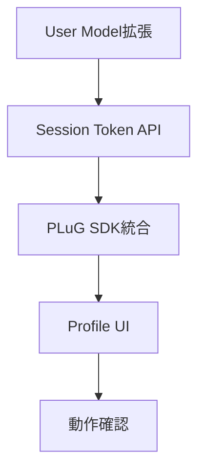
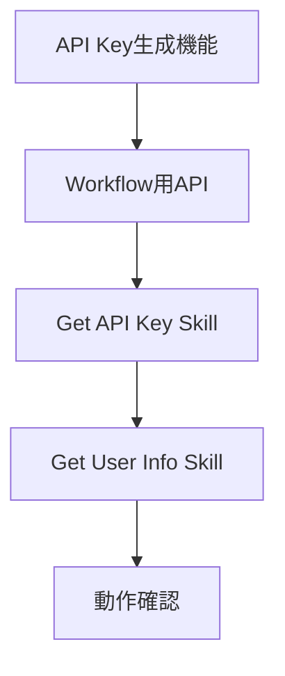
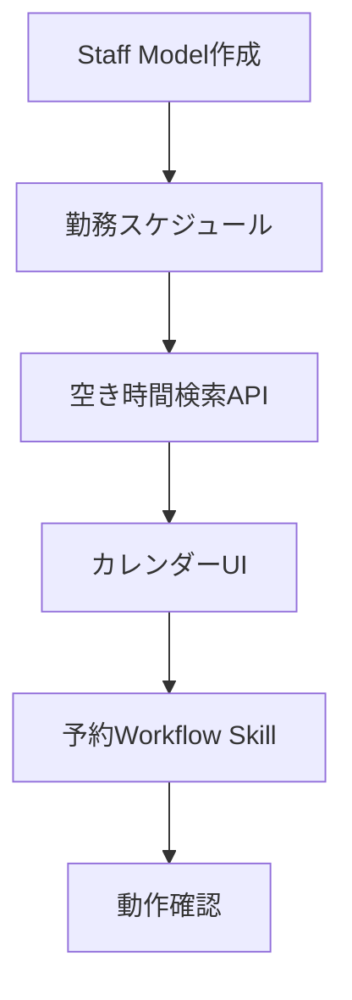

# 機能比較と実装ギャップ分析

## 📋 目次

1. [機能一覧比較](#機能一覧比較)
2. [実装ギャップ分析](#実装ギャップ分析)
3. [優先順位付け](#優先順位付け)
4. [DriveRev 固有の機能](#driverev固有の機能)

---

## 機能一覧比較

### 🔐 認証・ユーザー管理

| 機能                | PetStore | DriveRev    | 実装状況              | 優先度 |
| ------------------- | -------- | ----------- | --------------------- | ------ |
| ユーザー登録        | ✅       | ✅          | 完了                  | -      |
| ログイン/ログアウト | ✅       | ✅          | 完了                  | -      |
| パスワードリセット  | ✅       | ⚠️ 部分実装 | API 実装済、UI 未実装 | P2     |
| プロフィール編集    | ✅       | ✅          | 完了                  | -      |
| 管理者機能          | ✅       | ⚠️ 部分実装 | 基本的な権限管理のみ  | P3     |

### 🔌 DevRev 統合

| 機能                     | PetStore | DriveRev | 実装状況 | 優先度 |
| ------------------------ | -------- | -------- | -------- | ------ |
| **PLuG 基本統合**        |
| - PLuG Widget 表示       | ✅       | ❌       | 未実装   | **P0** |
| - カスタムランチャー     | ✅       | ❌       | 未実装   | P1     |
| - Session Token 生成     | ✅       | ❌       | 未実装   | **P0** |
| - Session Token 更新     | ✅       | ❌       | 未実装   | P1     |
| - RevUser ID 管理        | ✅       | ❌       | 未実装   | **P0** |
| **設定管理**             |
| - Personal DevRev Config | ✅       | ❌       | 未実装   | **P0** |
| - Global DevRev Config   | ✅       | ❌       | 未実装   | P1     |
| - App ID 設定            | ✅       | ❌       | 未実装   | **P0** |
| - AAT 設定               | ✅       | ❌       | 未実装   | **P0** |
| **API Key 管理**         |
| - API Key 生成           | ✅       | ❌       | 未実装   | P1     |
| - API Key 表示/削除      | ✅       | ❌       | 未実装   | P1     |
| - DevRev AAT 経由取得    | ✅       | ❌       | 未実装   | P1     |
| - 使用統計               | ✅       | ❌       | 未実装   | P2     |

### 📦 商品・在庫管理

| 機能           | PetStore (Pets)    | DriveRev (Vehicles) | 実装状況 | 優先度 |
| -------------- | ------------------ | ------------------- | -------- | ------ |
| 一覧表示       | ✅ Pets            | ✅ Vehicles         | 完了     | -      |
| 詳細表示       | ✅                 | ✅                  | 完了     | -      |
| カテゴリ別表示 | ✅ Pet Categories  | ✅ Vehicle Types    | 完了     | -      |
| 検索機能       | ✅                 | ✅                  | 完了     | -      |
| 在庫管理       | ✅                 | ✅                  | 完了     | -      |
| 価格管理       | ✅                 | ✅                  | 完了     | -      |
| 画像管理       | ✅ Multiple images | ⚠️ Single image     | 部分実装 | P2     |

### 📅 予約システム

| 機能                   | PetStore (Vet Appointments) | DriveRev (Reservations) | 実装状況    | 優先度 |
| ---------------------- | --------------------------- | ----------------------- | ----------- | ------ |
| **予約作成**           |
| - 基本予約作成         | ✅                          | ✅                      | 完了        | -      |
| - 日付選択             | ✅ カレンダー               | ⚠️ 入力フォーム         | UI 改善必要 | **P0** |
| - 時間枠選択           | ✅ タイムスロット           | ⚠️ 開始/終了時刻        | 改善必要    | **P0** |
| - サービス選択         | ✅ 8 種類のサービス         | ⚠️ 車両選択のみ         | 拡張必要    | P1     |
| - スタッフ選択         | ✅ Veterinarian 選択        | ❌                      | 未実装      | **P0** |
| **空き時間検索**       |
| - 日別空き時間         | ✅                          | ❌                      | 未実装      | **P0** |
| - スタッフ別空き時間   | ✅                          | ❌                      | 未実装      | **P0** |
| - サービス別空き時間   | ✅                          | ❌                      | 未実装      | P1     |
| **予約管理**           |
| - 予約一覧             | ✅                          | ✅                      | 完了        | -      |
| - 予約詳細             | ✅                          | ✅                      | 完了        | -      |
| - 予約キャンセル       | ✅                          | ✅                      | 完了        | -      |
| - ステータス更新       | ✅                          | ⚠️ 部分実装             | 管理者のみ  | P2     |
| **スタッフ管理**       |
| - スタッフ登録         | ✅ Veterinarians            | ❌                      | 未実装      | **P0** |
| - スタッフプロフィール | ✅ 専門分野など             | ❌                      | 未実装      | P1     |
| - 勤務スケジュール     | ✅ 曜日別                   | ❌                      | 未実装      | **P0** |
| - スタッフ検索 API     | ✅                          | ❌                      | 未実装      | P1     |

### 🛒 注文・決済

| 機能               | PetStore       | DriveRev            | 実装状況   | 優先度 |
| ------------------ | -------------- | ------------------- | ---------- | ------ |
| カート機能         | ✅ Products    | ❌                  | 不要       | -      |
| 注文作成           | ✅             | ✅ Reservation      | 統合済     | -      |
| 決済処理           | ⚠️ Stripe Demo | ⚠️ Stripe Demo      | テストのみ | P3     |
| 注文履歴           | ✅             | ✅ Reservation 履歴 | 完了       | -      |
| 注文ステータス追跡 | ✅             | ⚠️ 部分実装         | 改善必要   | P2     |

### 📊 管理機能

| 機能                   | PetStore | DriveRev        | 実装状況 | 優先度 |
| ---------------------- | -------- | --------------- | -------- | ------ |
| **ユーザー管理**       |
| - ユーザー一覧         | ✅       | ❌              | 未実装   | P2     |
| - ユーザー詳細         | ✅       | ❌              | 未実装   | P2     |
| - ロール変更           | ✅       | ❌              | 未実装   | P2     |
| **統計・分析**         |
| - ダッシュボード       | ✅       | ❌              | 未実装   | P3     |
| - 売上レポート         | ✅       | ❌              | 未実装   | P3     |
| - 利用統計             | ✅       | ❌              | 未実装   | P3     |
| **システム設定**       |
| - Global Configuration | ✅       | ❌              | 未実装   | P1     |
| - API 設定             | ✅       | ⚠️ 環境変数のみ | 改善必要 | P2     |

### 🔧 API・統合

| 機能                     | PetStore   | DriveRev        | 実装状況 | 優先度 |
| ------------------------ | ---------- | --------------- | -------- | ------ |
| **REST API**             |
| - CRUD エンドポイント    | ✅ 50+     | ✅ 20+          | 拡張必要 | P1     |
| - API 認証               | ✅ 3 方式  | ⚠️ JWT のみ     | 拡張必要 | P1     |
| - Rate Limiting          | ✅         | ❌              | 未実装   | P2     |
| - API Documentation      | ✅ Swagger | ✅ FastAPI Auto | 完了     | -      |
| **Workflow Integration** |
| - Get API Key            | ✅         | ❌              | 未実装   | P1     |
| - Get User Info          | ✅         | ❌              | 未実装   | P1     |
| - Book Appointment       | ✅         | ❌              | 未実装   | P1     |
| - Get Available Slots    | ✅         | ❌              | 未実装   | P1     |
| - Get All Services       | ✅         | ❌              | 未実装   | P2     |
| - Get All Staff          | ✅         | ❌              | 未実装   | P2     |
| **Webhook**              |
| - Webhook Endpoints      | ✅         | ❌              | 未実装   | P3     |
| - Event Notifications    | ✅         | ❌              | 未実装   | P3     |

---

## 実装ギャップ分析

### 🔴 クリティカル（P0） - 即座に実装必要

これらは DevRev AI Agent 学習の**最低限の前提条件**です。

#### 1. DevRev PLuG 基本統合

- **Session Token 生成** (`POST /api/v1/auth/devrev/session-token`)
- **RevUser ID 管理** (User model に追加)
- **PLuG Widget 表示** (Frontend integration)
- **Personal DevRev Config** (User Profile UI)

**実装工数**: 2-3 日
**依存関係**: なし
**ブロッカー**: これがないと PLuG Chat が使えない

#### 2. 予約カレンダーシステム

- **スタッフ（Staff）モデル** (Veterinarian と同等)
- **勤務スケジュール管理**
- **空き時間検索 API** (`GET /api/v1/reservations/available-slots`)
- **カレンダー UI コンポーネント**

**実装工数**: 3-4 日
**依存関係**: なし
**ブロッカー**: これがないと予約ワークフローが動かない

### 🟠 高優先度（P1） - 早期実装推奨

DevRev Workflow の**実践的な学習**に必要な機能です。

#### 3. API Key 管理

- **API Key 生成・削除** (`POST /api/v1/auth/api-key`)
- **DevRev AAT 経由取得** (`POST /api/v1/auth/devrev/get-api-key`)
- **User Profile UI** (API Keys section)

**実装工数**: 1-2 日
**依存関係**: P0 完了後
**用途**: Workflow Skill からの API 呼び出し

#### 4. Global Configuration

- **GlobalConfig Model** (PetStore から移植)
- **Admin UI** (Global DevRev 設定)
- **Configuration API** (`GET/PUT /api/v1/admin/config`)

**実装工数**: 1-2 日
**依存関係**: なし
**用途**: デモ環境での共通設定

#### 5. Workflow 用 API エンドポイント

- **Get User Info** (`GET /api/v1/admin/user?devrev_revuser_id=`)
- **Book Reservation** (`POST /api/v1/reservations?api_key=`)
- **Get Available Slots** (`GET /api/v1/reservations/available-slots`)
- **Get All Vehicles** (`GET /api/v1/vehicles`)
- **Get All Staff** (`GET /api/v1/staff`)

**実装工数**: 2-3 日
**依存関係**: P0, P1 の一部
**用途**: DevRev Workflow Skill からの呼び出し

### 🟡 中優先度（P2） - 段階的実装

ユーザー体験を向上させる機能です。

- パスワードリセット UI
- 複数画像対応
- 注文ステータス追跡改善
- API Rate Limiting
- 管理者ユーザー管理画面

**実装工数**: 5-7 日
**依存関係**: P0, P1 完了後

### 🟢 低優先度（P3） - 将来的に追加

トレーニングには不要だが、あると便利な機能です。

- ダッシュボード
- Webhook 統合
- 決済処理（本番対応）
- 詳細な統計・分析

**実装工数**: 10+日
**依存関係**: すべて完了後

---

## 優先順位付け

### Phase 1: DevRev PLuG 基盤（P0） - Week 1-2

**成果物**:

- ✅ ユーザーが PLuG 設定を入力できる
- ✅ Session Token が生成される
- ✅ PLuG Widget が表示される
- ✅ ユーザー ID が正しく認識される

### Phase 2: API Key & Workflow 連携（P1） - Week 3

**成果物**:

- ✅ ユーザーが API Key を生成できる
- ✅ DevRev Workflow から API Key を取得できる
- ✅ 基本的な Workflow Skill が動作する

### Phase 3: 予約カレンダー（P0+P1） - Week 4-5

**成果物**:

- ✅ スタッフ管理機能
- ✅ カレンダーベースの予約 UI
- ✅ 空き時間検索
- ✅ DevRev Agent から予約できる

### Phase 4: Global Config & 管理機能（P1+P2） - Week 6

**成果物**:

- ✅ Global DevRev Configuration
- ✅ 管理者ダッシュボード
- ✅ ユーザー管理画面

### Phase 5: 最適化 & ドキュメント（P2+P3） - Week 7-8

**成果物**:

- ✅ Rate Limiting
- ✅ 完全な API Documentation
- ✅ ハンズオンラボガイド
- ✅ サンプル Workflow 集

---

## DriveRev 固有の機能

PetStore にはない、DriveRev 独自の機能やアドバンテージ：

### 1. モダンな UI/UX

- ✅ Next.js App Router
- ✅ TypeScript
- ✅ React 18
- ✅ Tailwind CSS（最新版）

### 2. 型安全性

- ✅ Pydantic (Backend)
- ✅ TypeScript (Frontend)
- ✅ 自動バリデーション

### 3. パフォーマンス

- ✅ 非同期処理 (FastAPI)
- ✅ クライアントサイドルーティング
- ✅ 画像最適化 (Next.js)

### 4. スケーラビリティ

- ✅ Stateless JWT 認証
- ✅ PostgreSQL
- ✅ Cloud Run 対応設計

### 5. 開発者体験

- ✅ 自動 API Documentation
- ✅ Hot Reload
- ✅ TypeScript Intellisense

---

## まとめ

### 実装が必要な主要機能（優先度順）

1. **P0 - DevRev PLuG 統合** (2-3 日)
2. **P0 - 予約カレンダー基盤** (3-4 日)
3. **P1 - API Key 管理** (1-2 日)
4. **P1 - Workflow 用 API** (2-3 日)
5. **P1 - Global Configuration** (1-2 日)

**合計推定工数**: 約 4-6 週間

### 次のステップ

👉 [03_IMPLEMENTATION_PLAN.md](./03_IMPLEMENTATION_PLAN.md) で詳細な実装計画を確認
